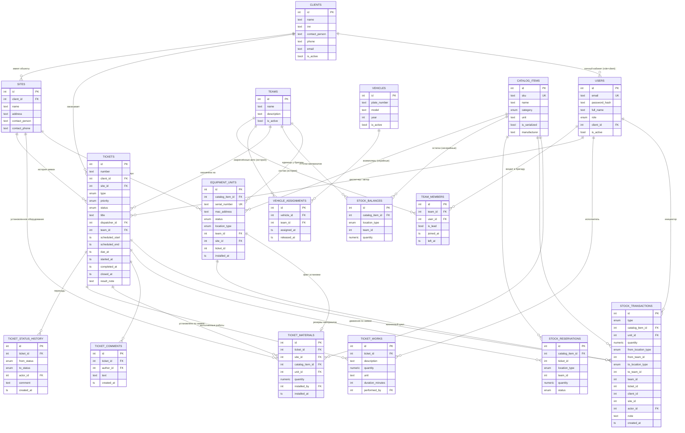

# 2. Схема базы данных

Источник истины — `src/db/schema.ts` (Drizzle ORM). Применение: `npm run db:push` (dev) или `db:generate` + `db:migrate` (prod).

## 2.1. ER-диаграмма

## 2.2. Перечисления (ENUM)

| Тип | Значения | Назначение |
|---|---|---|
| `user_role` | `admin, dispatcher, technician, warehouse, client` | Роль пользователя (см. 04-roles) |
| `ticket_status` | `new, assigned, scheduled, in_progress, on_hold, done, closed, cancelled` | Статус заявки (см. 07-business-processes) |
| `ticket_priority` | `low, normal, high, critical` | |
| `ticket_type` | `installation, maintenance, repair, inspection, other` | Монтаж / ТО / Ремонт / Обследование |
| `catalog_category` | `camera, recorder, controller, reader, lock, cable, mount, power, network, consumable, other` | Категория номенклатуры |
| `unit_status` | `in_warehouse, at_team, reserved, installed, written_off` | Состояние серийной единицы |
| `location_type` | `warehouse, team, site` | Тип местонахождения |
| `stock_tx_type` | `receive, issue_to_team, return_to_warehouse, reserve, unreserve, install, write_off` | Тип складской операции |
| `reservation_status` | `active, consumed, cancelled` | Состояние резерва материалов |

## 2.3. Описание таблиц

### Клиенты и объекты
- **clients** — юр./физ. лицо-заказчик. `is_active` — мягкое удаление.
- **sites** — объект (площадка/адрес) клиента. `client_id` (FK, `ON DELETE CASCADE`). У клиента может быть много объектов; объект принадлежит ровно одному клиенту.

### Пользователи
- **users** — все учётные записи (сотрудники и клиентские пользователи). `email` уникален. `client_id` заполняется только для `role=client` и ограничивает видимость данных этим клиентом. Пароль — bcrypt-хеш.

### Бригады и автомобили
- **teams** — бригада монтажников.
- **team_members** — *история* участия: активная запись имеет `left_at IS NULL`. Ограничение «не более 3 активных участников» и «сотрудник в одной бригаде одновременно» обеспечиваются сервисным слоем (`POST /teams/{id}/members`).
- **vehicles** — автопарк.
- **vehicle_assignments** — *история* закрепления авто за бригадами (`released_at IS NULL` — текущее). Одно авто одновременно закреплено за одной бригадой (при переназначении старая запись закрывается).

### Номенклатура и запасы
- **catalog_items** — типы оборудования/материалов. `sku` уникален. `is_serialized=true` ⇒ учёт поштучно через `equipment_units`; `false` ⇒ количественный через `stock_balances`. `unit` — единица измерения (шт, м, …).
- **equipment_units** — конкретная физическая единица серийного оборудования. `serial_number` уникален глобально. Текущее состояние:
  - `status=in_warehouse` → `location_type=warehouse`, `team_id=NULL`
  - `status=at_team` → `location_type=team`, `team_id` = бригада
  - `status=reserved` → `ticket_id` = заявка; `team_id` = бригада-держатель (или NULL, если резерв со склада)
  - `status=installed` → `location_type=site`, `site_id`, `ticket_id`, `installed_at`
  - `status=written_off` — списана
- **stock_balances** — *свободные* (не зарезервированные) остатки несерийных материалов в разрезе (`catalog_item_id`, `location_type`, `team_id`). Для центрального склада `location_type=warehouse, team_id=0`. Уникальный индекс `stock_balance_uniq`. Отрицательные остатки запрещены сервисным слоем.
- **stock_reservations** — резервы несерийных материалов под заявку. При резерве количество вычитается из `stock_balances`; при установке резерв переходит в `consumed`; при снятии — `cancelled` с возвратом в остаток.
- **stock_transactions** — **журнал всех движений** (append-only). Каждая запись: тип, номенклатура, единица (для серийных), количество, откуда/куда (`from_/to_location_type`, `from_/to_team_id`), а также аналитика: `team_id`, `ticket_id`, `client_id`, `site_id`, `actor_id`, `note`. По `unit_id` строится жизненный цикл единицы; по `team_id/client_id/ticket_id` — отчёты о расходе.

### Заявки
- **tickets** — заявка. `number` — человекочитаемый номер `ЗК-ГГГГ-NNNNN`, присваивается после вставки. Связи: `client_id`, `site_id` (объект обязан принадлежать клиенту — проверка в сервисе), `team_id` (назначенная бригада), `dispatcher_id`. Даты: `scheduled_start/end` (план выезда), `due_at` (срок), `started_at`, `completed_at`, `closed_at`. `result_note` — итог работ.
- **ticket_status_history** — все переходы статусов с автором и комментарием.
- **ticket_works** — выполненные работы (описание, количество, ед., длительность, исполнитель). Основа для отчёта по загрузке сотрудников.
- **ticket_materials** — что установлено по заявке (= оборудование на объекте, `site_id` денормализован для быстрой выборки). Для серийных — ссылка `unit_id`.
- **ticket_comments** — комментарии.

## 2.4. Инварианты и ограничения целостности

| Инвариант | Где обеспечивается |
|---|---|
| Серийный номер уникален | UNIQUE `units_serial_idx` |
| Артикул уникален | UNIQUE `catalog_sku_idx` |
| Email уникален | UNIQUE `users_email_idx` |
| Один остаток на (номенклатура, место, бригада) | UNIQUE `stock_balance_uniq` |
| Остатки ≥ 0 | `adjustBalance()` в транзакции (409 при нехватке) |
| Каждое изменение состояния запасов сопровождается записью в журнал | все операции `services/inventory.ts` выполняются в `db.transaction` |
| Установка только из остатков бригады заявки или её резервов | `install()` |
| Переходы статусов только по матрице `TRANSITIONS` | `changeStatus()` |
| Бригада ≤ 3 активных участников | `POST /teams/{id}/members` |
| Объект заявки принадлежит клиенту заявки | `createTicket()` |

## 2.5. Индексы

Индексы созданы по всем внешним ключам, участвующим в фильтрации: `tickets(status, client_id, site_id, team_id)`, `equipment_units(status, team_id, site_id)`, `stock_transactions(unit_id, ticket_id, team_id, client_id, created_at)`, `ticket_materials(ticket_id, site_id)`, `team_members(team_id, user_id)`, `vehicle_assignments(team_id, vehicle_id)` и др.

## Справочники (добавлены)

Значения, которые раньше были перечислениями PostgreSQL, вынесены в таблицы — их ведёт
администратор в разделе «Справочники»:

| Таблица | Заменила enum | Ключевые поля |
|---|---|---|
| `roles` | `user_role` | `code`, `name`, `scope` (`all`/`team`/`client`), `is_field_staff`, `permissions text[]`, `is_system` |
| `ticket_types` | `ticket_type` | `code`, `name`, `sort_order`, `is_active` |
| `ticket_priorities` | `ticket_priority` | `code`, `name`, `sla_hours`, `color_class` |
| `catalog_categories` | `catalog_category` | `code`, `name`, `sort_order` |
| `measure_units` | — (было свободным текстом) | `code` (`шт`, `м`, `компл`), `name` |

Соответствующие ссылки: `users.role_id`, `tickets.type_id`, `tickets.priority_id`,
`catalog_items.category_id`. Перечислениями остались только те значения, с которыми связана логика
кода: `ticket_status` (автомат переходов), `unit_status`, `location_type`, `stock_tx_type`,
`reservation_status`, `role_scope`.

Записи с `is_system = true` создаются при первом запуске (`ensureSystemDirectories()` в `src/db/seed.ts`),
переименовываются и отключаются, но не удаляются.

## Чат по заявке

Таблица `ticket_comments` расширена до полноценной ленты обсуждения:

| Поле | Назначение |
|---|---|
| `is_internal` | `true` — внутреннее сообщение, заказчик его не видит |
| `author_name` | имя автора на момент отправки: сообщение остаётся читаемым после удаления сотрудника |
| `edited_at` | отметка о редактировании |

Индекс `comments_ticket_idx (ticket_id, created_at)` обслуживает как загрузку ленты, так и дозагрузку
новых сообщений по `id`.
