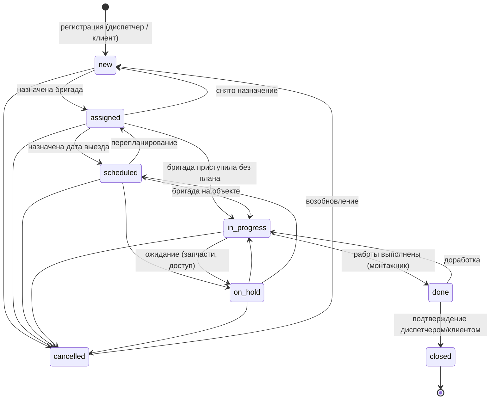
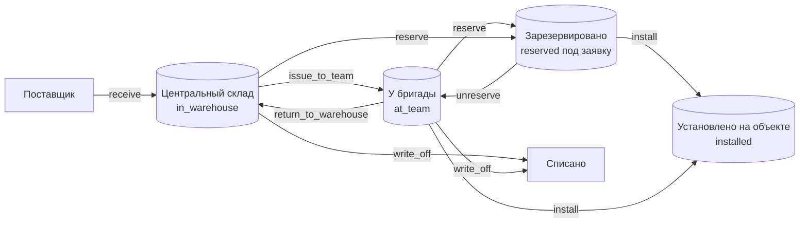

# 7. Бизнес-процессы

## 7.1. Жизненный цикл заявки

| Статус | Смысл | Кто переводит | Автоматика |
|---|---|---|---|
| `new` Новая | зарегистрирована, бригада не назначена | создание | номер `ЗК-ГГГГ-NNNNN`, запись в историю |
| `assigned` Назначена | есть бригада | диспетчер | PATCH с `teamId` из `new` |
| `scheduled` Запланирована | есть бригада и дата выезда | диспетчер | PATCH с `scheduledStart` при бригаде |
| `in_progress` В работе | бригада на объекте | монтажник | фиксируется `started_at` |
| `on_hold` Приостановлена | ожидание | монтажник / диспетчер | |
| `done` Выполнена | работы завершены, ждёт подтверждения | монтажник | `completed_at`; комментарий → `result_note` |
| `closed` Закрыта | подтверждена, финальный статус | диспетчер | `closed_at` |
| `cancelled` Отменена | | диспетчер | |

Каждый переход проверяется по матрице `TRANSITIONS` и правам роли; записывается в `ticket_status_history` (кто, когда, комментарий).

## 7.2. Сквозной процесс «от звонка до закрытия»

1. **Регистрация.** Диспетчер принимает обращение (или клиент создаёт заявку сам в личном кабинете). Заявка привязывается к клиенту и объекту.
2. **Назначение.** Диспетчер выбирает бригаду с учётом загрузки (карточки бригад показывают активные заявки) и назначает дату выезда.
3. **Подготовка.** Диспетчер/склад резервируют под заявку нужное оборудование: из остатков бригады (если у неё уже есть) или со склада с последующей отгрузкой бригаде. Монтажники в «Моей бригаде» видят, что зарезервировано под какие заявки.
4. **Выезд.** Бригада на объекте переводит заявку «В работе» с телефона.
5. **Выполнение.** Монтажники фиксируют работы (что, сколько, минут, кто) и устанавливают оборудование: выбирают серийную единицу/материал из остатков бригады → система списывает с бригады, привязывает к объекту и заявке, пишет операцию `install` в журнал.
6. **Завершение.** Монтажник пишет итог и переводит в «Выполнена».
7. **Закрытие.** Диспетчер подтверждает с клиентом и закрывает. История обслуживания объекта и клиента пополняется; установленное оборудование отображается в карточке объекта.

## 7.3. Движение запасов

**Правила:**
- Каждая стрелка — отдельная транзакция БД: изменение состояния + запись в `stock_transactions` с бригадой, заявкой, клиентом, объектом и инициатором.
- Установка (`install`) возможна только по заявке с назначенной бригадой; источник — резерв этой заявки или свободные остатки **этой** бригады. Для материалов сначала расходуется резерв, затем свободный остаток.
- Возврат на склад — только свободных единиц (резерв нужно снять).
- Серийные единицы: состояние + место хранятся в `equipment_units`, история — в журнале по `unit_id`.
- Несерийные материалы: свободные остатки в `stock_balances`, резервы в `stock_reservations`, установленное — в `ticket_materials`.

## 7.4. Управление бригадами

- Бригада — 2–3 монтажника; один может быть отмечен «старшим».
- Перевод сотрудника в другую бригаду автоматически закрывает его участие в прежней (`left_at`). История сохраняется для корректной ретроспективы заявок.
- Автомобиль закрепляется за одной бригадой; при перезакреплении предыдущая запись закрывается (`released_at`).
- Остатки бригады не зависят от состава: при смене состава оборудование остаётся за бригадой; при расформировании — возврат на склад.

## 7.5. Контроль загрузки и эффективности

- По каждому монтажнику: количество выполненных работ, часы (сумма `duration_minutes`), число заявок с его участием.
- По бригаде: активные, выполненные, просроченные заявки, среднее время выполнения (`completed_at - started_at`).
- Просрочка: `due_at < now()` и статус не в (`done`, `closed`, `cancelled`).

## Обсуждение заявки

Параллельно жизненному циклу заявки ведётся чат: диспетчер ставит задачи бригаде, бригада отчитывается
о ходе работ, склад уточняет комплектацию. Внутренние сообщения заказчику не видны; чтобы написать ему,
сообщение помечается открытым. После перехода заявки в `closed` или `cancelled` лента доступна только
для чтения. Подробности — в [09-directories-chat-deletion.md](09-directories-chat-deletion.md).

## Исправление ошибок ввода

Отмена (`cancelled`) — это бизнес-решение: заявка остаётся в истории и в отчётах. Удаление — это
исправление ошибки ввода, и оно доступно, только пока запись не участвует в учёте: по заявке нет
складских движений, у клиента нет объектов и заявок, у бригады нет остатков и т. д. Если помеха есть,
система перечисляет её и предлагает деактивацию вместо удаления — полная таблица правил в
[09-directories-chat-deletion.md](09-directories-chat-deletion.md).
